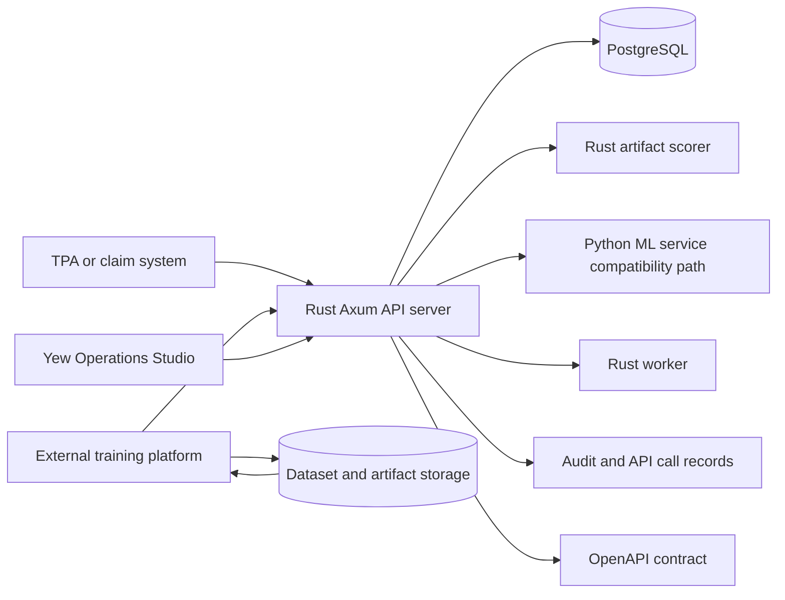

# Architecture

`nwfwa` is a health-insurance FWA risk and operations platform. It helps TPA and
insurance teams score suspicious claims, explain risk evidence, route cases,
manage rules and models, and preserve a governed audit trail.

The platform is assistive. It recommends review actions and prepares evidence
packages, but it does not directly adjudicate, deny, approve, or accuse fraud.

## System Boundary

## Runtime Components

| Component | Path | Responsibility |
| --- | --- | --- |
| API server | `apps/api-server` | Axum API, scoring, ops workflows, OpenAPI, repository layer, Rust artifact scorer selection |
| Web console | `apps/web-console` | Yew/Trunk operator UI for inbox correction, scoring, and operations |
| ML runtime | `crates/fwa-ml-runtime` | Rust scorer trait, JSON logistic artifact scorer, HTTP scorer compatibility, heuristic fallback |
| ML service | `apps/ml-service` | FastAPI compatibility scorer and Python training/export workflow |
| External training platform | customer or ML platform boundary | Runs training jobs outside the API server while consuming the same governed dataset manifest and returning the standard retraining output payload |
| Worker | `apps/worker` | Health-checkable worker and retraining job runner |
| PostgreSQL schema | `migrations/0001_initial.sql` | Claims, scoring, audit, rules, models, cases, QA, datasets |
| Demo scripts | `scripts/demo` | Seed data, smoke checks, persistence assertions, mock TPA client |
| CI scripts | `scripts/ci` | Repository and worker-health checks |

## Domain Crates

| Crate | Responsibility |
| --- | --- |
| `fwa-core` | Shared IDs, scheme taxonomy, core helpers |
| `fwa-features` | Claim, member, provider, policy, and feature evidence |
| `fwa-rules` | Deterministic FWA rule evaluation |
| `fwa-anomaly` | Anomaly signal helpers |
| `fwa-clinical` | Clinical and medical necessity helpers |
| `fwa-provider` | Provider profile and peer-risk helpers |
| `fwa-scoring` | Score assembly and layer composition |
| `fwa-ml-runtime` | HTTP model scorer and heuristic fallback boundary |
| `fwa-audit` | Actor context and audit helpers |
| `fwa-auth` | API-key validation |
| `fwa-connectors` | Integration boundary helpers |
| `fwa-agent` | Deterministic assistive investigation packages |

## Main Workflows

### Review Mode Boundary

`review_mode` separates pre-payment and post-payment use cases. It is a shared
governance dimension for scoring, rules, models, thresholds, and routing
policies. Pre-payment behavior should bias toward precise intervention before
payment. Post-payment behavior may support audit, recovery, model evaluation,
and ROI analysis.

### Claim Scoring

1. TPA or UI calls `POST /api/v1/claims/score`.
2. API loads stored claim data or uses the submitted payload.
3. Feature, rule, anomaly, clinical, provider, model, and confidence layers run.
4. API writes `scoring_runs`, `feature_values`, `rule_runs`, `model_scores`,
   audit events, and lead records when applicable.
5. Response returns risk score, RAG, recommended action, evidence refs, and IDs.

### Lead And Case Operations

1. High-risk scoring creates or updates an FWA lead.
2. Operators view leads in Leads & Cases.
3. Triage can open a case, merge a lead, or close without case creation.
4. Cases preserve evidence packages, SLA status, assignee, reviewer, and status.
5. Investigation and QA writebacks append outcome and feedback events.

### Rule Governance

Rules move through candidate, submitted, approved, published, active, and
rollback states. Promotion gates check backtest results, label evidence, and
governance metadata before publication.

### Model Operations

Model operations tracks versions, evaluations, performance, drift, promotion
gates, retraining readiness, retraining jobs, artifact contracts, activation,
and rollback. Production training may run on an external training platform, but
the platform must consume the same governed Parquet dataset manifest and return
the same retraining output payload that the API validates. The demo keeps the
Python HTTP ML service as a compatibility path.

### Dataset And Feature Lineage

Data Sources and Factor Factory register external Parquet dataset metadata,
schema fields, field mappings, feature definitions, feature-set versions, model
datasets, and model evaluation runs.

### Knowledge And Agent Assistance

Knowledge cases store confirmed FWA examples and evidence provenance. Similar
case search supports investigation context. Agent Investigator creates an
assistive-only investigation package and records audit evidence.

### QA, Medical Review, And Feedback

QA, investigation, and medical review writebacks create audit events and
structured labels. Labels feed governance views, rule tuning, model evaluation,
and workflow analysis.

### Evidence Sufficiency And Clinical Routing

Evidence sufficiency is evaluated by FWA scheme family. Case and agent evidence
packages should preserve claim, rule, model, anomaly, document, and similar-case
references. Clinical and medical necessity workflows should identify missing
records, diagnosis/procedure mismatches, documentation issues, and insufficient
evidence before any customer adjudication process.

## Web Console Modules

These modules are demo and pilot-operator surfaces. A page existing in the
console does not mean the corresponding customer environment, object storage,
backup, retention, or production monitoring setup is complete.

| Module | Purpose |
| --- | --- |
| Claim Inbox | Normalize raw claim-system payloads, review findings, apply correction overlays, approve scoring |
| Dashboard | Summary rollups, risk amount, RAG distribution, QA, cases, savings |
| Runtime Scoring | Submit demo claims and inspect score layers |
| Rules | Rule library, backtests, discovery, lifecycle, promotion, rollback |
| Models | Model registry, performance, drift, gates, retraining, rollback |
| Routing Policies | L7 routing lifecycle, thresholds, promotion gates |
| Data Sources | Dataset catalog, splits, schema, mappings, model evaluations |
| Factor Factory | Factor readiness and predictive signal summaries |
| Leads & Cases | Lead triage, cases, SLA, investigation writeback |
| Member Profile | TPA-facing member profile summary and risk history |
| Provider Risk | Provider profile, peer outlier, graph, and evidence gaps |
| Medical Review | Clinical evidence queue and reviewer writeback |
| Audit Sampling | QA samples, cohorts, missed-risk and false-positive signals |
| Knowledge Base | Confirmed cases and similar-case retrieval |
| Agent Investigator | Assistive investigation package generation |
| QA Review | QA queue and QA result writeback |
| Governance | Audit events, API calls, webhooks, approvals, labels, gates |

## Deployment Shape

The current repository supports a local modular monolith path:

- PostgreSQL 16 through Docker Compose.
- S3-compatible MinIO object storage through Docker Compose for staging proof.
- Python FastAPI ML service through Docker Compose or local uvicorn.
- Rust API server through `cargo run --locked -p api-server`.
- Yew web console through `NO_COLOR=false trunk serve`.
- Kubernetes staging manifests under `infra/k8s/staging` for API server, web
  console, ML service, PostgreSQL, object storage, and worker CronJobs.

Production deployment is not configured yet. The Kubernetes manifests are a
staging architecture and proof surface; environment-specific production
deployment, managed secrets, key rotation, observability, object storage, and
customer network controls must still be selected before production use.

Pilot foundation work is also still required before customer data is used:
object storage health, backup and restore, retention and legal hold, tenant or
customer scoping, prompt/log/vector PII masking, minimum metrics, and alert
routing.
