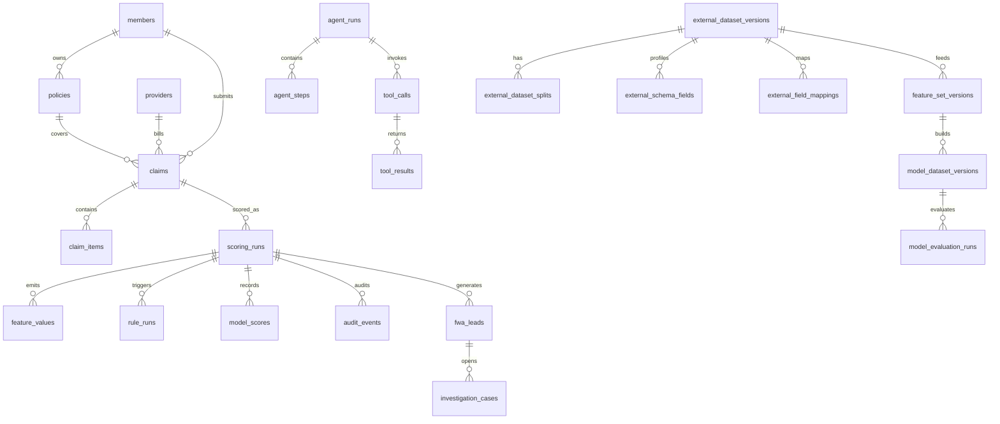

# Data Model

The database is PostgreSQL. The schema is defined in
`migrations/0001_initial.sql` and is intentionally idempotent for local and CI
setup.

## High-Level ERD



## Table Groups

### Claim And Policy Core

| Table | Purpose |
| --- | --- |
| `members` | Member identity and demographic context for scoring. |
| `policies` | Coverage, waiting-period, limit, and status context. |
| `providers` | Provider identity, specialty, region, and network context. |
| `claims` | Claim header data, amounts, dates, diagnosis, procedure, and status. |
| `claim_items` | Line-level services, procedure codes, amounts, and quantities. |

These tables represent the minimum stored claim universe for local demo scoring.

### Rule And Model Runtime

| Table | Purpose |
| --- | --- |
| `rules` | Rule identity, owner, lifecycle, scope, and metadata. |
| `rule_versions` | Versioned rule definitions and expression metadata. |
| `model_versions` | Model version registry and deployment status. |
| `routing_policies` | Review routing policy candidates and active versions. |

These tables define governed runtime behavior.

### Scoring Evidence

| Table | Purpose |
| --- | --- |
| `scoring_runs` | One persisted scoring execution per scored claim. |
| `feature_values` | Feature evidence emitted during scoring. |
| `rule_runs` | Rule hits and rule evidence for one scoring run. |
| `model_scores` | Model score records for one scoring run. |
| `audit_events` | Append-only operational and workflow audit events. |
| `webhook_delivery_attempts` | Delivery attempt evidence for webhook-style events. |

Scoring evidence is the backbone for explainability, audit history, and demo
persistence checks.

### Knowledge And Agent

| Table | Purpose |
| --- | --- |
| `knowledge_cases` | Confirmed FWA cases used for similar-case retrieval. |
| `agent_runs` | Agent investigation run headers. |
| `agent_steps` | Step-level agent reasoning and checklist records. |
| `agent_context_snapshots` | Context captured for agent governance. |
| `tool_calls` | Tool invocation records associated with agent runs. |
| `tool_results` | Tool result records associated with agent runs. |
| `agent_policy_checks` | Agent guardrail and policy check records. |
| `agent_approvals` | Human approval or rejection for agent outputs. |

Agent data is auditable and assistive-only.

### Lead, Case, And Review Workflow

| Table | Purpose |
| --- | --- |
| `fwa_leads` | Generated leads from scoring or operational signals. |
| `investigation_cases` | Case workflow, SLA, assignment, reviewer, and evidence package. |
| `audit_samples` | QA and audit sampling records. |
| `investigation_results` | Investigation writeback outcomes. |
| `saving_attributions` | Prevented, recovered, and attribution amounts. |
| `qa_reviews` | QA review writebacks and feedback targets. |

These tables connect scoring to human workflow and feedback labels.

### External Data And Feature Lineage

| Table | Purpose |
| --- | --- |
| `external_data_sources` | Source systems and ownership metadata. |
| `external_dataset_versions` | Dataset catalog records and storage URIs. |
| `external_dataset_splits` | Train, validation, test, or holdout split metadata. |
| `external_schema_fields` | Field profiles, types, entity keys, and PII flags. |
| `external_field_mappings` | Source-to-canonical field mappings. |
| `feature_definitions` | Reusable feature definitions. |
| `feature_set_versions` | Feature-set versions tied to datasets. |
| `model_dataset_versions` | Model-ready dataset versions tied to feature sets. |
| `model_evaluation_runs` | Evaluation metrics, confusion matrix, and artifact URIs. |

The schema stores metadata and lineage. Large data rows should live in Parquet
files outside PostgreSQL for real pilots.

### Promotion And Retraining

| Table | Purpose |
| --- | --- |
| `model_promotion_reviews` | Human model promotion review decisions. |
| `model_retraining_jobs` | Queued, claimed, running, completed, or failed retraining jobs. |
| `rule_promotion_reviews` | Human rule promotion review decisions. |
| `rule_backtest_runs` | Rule backtest result records. |

These tables support governed lifecycle changes and rollback evidence.

## Relationship Notes

- Claims reference members, policies, and providers.
- Claim items cascade when a claim is deleted.
- Scoring evidence cascades from `scoring_runs` where configured.
- Leads reference scoring runs.
- Cases reference leads.
- Feature sets reference external dataset versions.
- Model datasets reference feature-set versions.
- Model evaluations reference model datasets.
- Agent steps, tool calls, results, checks, and approvals reference agent runs.

## JSONB Usage

JSONB stores flexible evidence and metrics payloads:

- scoring layers and evidence packages
- audit payloads
- rule metadata
- model metrics
- confusion matrices
- provider profile details
- agent context snapshots

Use JSONB for extensible evidence, not for replacing stable relational keys.

## Demo Data

The deterministic demo seed creates:

- `CLM-0287` and `CLM-9100`
- FWA rules for early high-value and high amount-to-limit signals
- knowledge cases `KC-1001` and `KC-1002`
- dataset `demo_claims_fwa@2026-05-demo`
- baseline model evaluation `eval-baseline-fwa-2026-05-demo`
- historical audit timeline data

Run:

```bash
scripts/demo/seed_demo.sh
```

Validate persisted demo data:

```bash
psql "$DATABASE_URL" \
  -v ON_ERROR_STOP=1 \
  -f scripts/demo/assert_demo_persistence.sql
```

## Data Governance Rules

- Keep `policy_no`, `order_no`, and similar external identifiers as strings.
- Do not write PII into free-text notes, summaries, or evidence refs.
- Use evidence refs as structured pointers to rows, documents, rules, models, or
  audit events.
- Keep Parquet data in object storage or data-lake storage for real pilots.
- Keep PostgreSQL focused on metadata, state, governance, and audit records.
