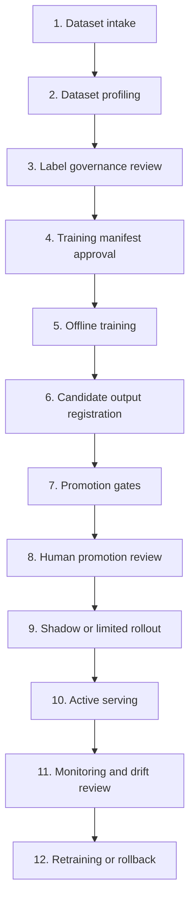

# ML Pipeline Runbook

This runbook defines the production ML workflow for `nwfwa`. It describes the
process, evidence, commands, owners, and gates. It does not require a final
production-quality model to exist before the workflow can be exercised.

## Operating Principle

The ML pipeline is an evidence factory, not an automatic adjudication system.

The process may automate dataset checks, feature materialization, training,
evaluation, artifact creation, and registration. Human review remains required
for label governance and model promotion because model output can influence FWA
routing and investigation workload.

## Workflow Summary



## Stage 1: Dataset Intake

Purpose: make the source dataset immutable and traceable before it can feed
training.

Required inputs:

- Parquet dataset path or partition directory.
- `dataset_key` and `dataset_version`.
- `label_column`.
- `entity_keys`, at minimum claim, member, policy, and provider identifiers.
- `service_date` or another approved time split field.
- `case_family_id` when related claims or investigations can leak across splits.
- business owner and source system.

Required evidence:

- immutable dataset URI;
- schema hash;
- row count by split;
- label distribution by split;
- source data quality score;
- dataset usage scope, such as pilot/customer, demo, or public research.

The API server stores dataset metadata and lineage. Large rows remain in Parquet
storage.

## Stage 2: Dataset Profiling

Purpose: verify the dataset is structurally usable before training.

Command:

```bash
cargo run --locked -p worker -- profile-parquet \
  --manifest data/training/manifest.json \
  --output-dir data/training/profile
```

Checks:

- manifest has at least one split;
- all split paths are Parquet files or Parquet directories;
- schemas match across splits;
- label column exists;
- entity keys exist;
- entity keys are string columns;
- missing rates and label distributions are captured.

Output artifacts:

- `schema.json`;
- `profile.json`;
- `catalog.json`.

## Stage 3: Label Governance Review

Purpose: decide whether labels may be used for training.

Reviewer responsibilities:

- confirm label definition, for example `confirmed_fwa`;
- reject labels produced only by the candidate model itself;
- separate final adjudication labels from investigation-support labels;
- mark labels as `approved_for_training` only after QA, investigation, medical,
  or business review;
- keep unresolved or disputed labels out of training promotion evidence.

Required evidence:

- reviewer source;
- approval status;
- notes without PII;
- evidence refs for the label source;
- count of approved labels and labels still needing review.

## Stage 4: Training Manifest Approval

Purpose: approve the exact training contract before execution.

Minimum manifest shape:

```json
{
  "dataset_key": "claims_model",
  "dataset_version": "2026-06-02",
  "label_column": "confirmed_fwa",
  "entity_keys": ["claim_id", "member_id", "policy_id", "provider_id"],
  "time_split_field": "service_date",
  "group_split_fields": ["member_id", "policy_id", "provider_id", "case_family_id"],
  "splits": [
    {"split_name": "train", "data_uri": "split=train/"},
    {"split_name": "validation", "data_uri": "split=validation/"},
    {"split_name": "out_of_time", "data_uri": "split=out_of_time/"}
  ]
}
```

Approval checks:

- time split exists and is not a post-outcome field;
- group split fields cover member, policy, provider, and case family when
  available;
- post-investigation fields are labels or excluded features;
- public research data is not treated as customer/pilot validation evidence;
- training data usage is compatible with the customer or pilot contract.

## Stage 5: Offline Training

Purpose: create a candidate model artifact and validation evidence.

Command:

```bash
cd apps/ml-service
python -m app.train \
  --manifest ../../data/training/manifest.json \
  --artifact-base-uri ../../data/model-artifacts \
  --model-key baseline_fwa \
  --base-model-version 0.1.0 \
  --job-id model_retraining_job_1 \
  --actor trainer-worker
```

Current implementation:

- logistic regression baseline;
- numeric feature columns from the manifest dataset;
- `.joblib` model artifact;
- `validation.json`;
- `feature_importance.parquet`;
- `serving_manifest.json` with artifact checksum, signature, and version lock;
- `feature_store_manifest.json` with materialized feature columns, split row
  counts, entity keys, and null-count evidence;
- `shadow_report.json` comparing the candidate against the heuristic baseline;
- `drift_report.json` with feature PSI and aggregate score PSI;
- `fairness_report.json` with segment precision and recall slices;
- retraining output payload printed to stdout.

The first production candidate should remain interpretable. Gradient-boosted
trees may be added later only when validation, explanation, and shadow evidence
are in place.

## Stage 6: Worker-Driven Candidate Registration

Purpose: let the worker claim a retraining job, run the trainer, and register
the candidate output with the API.

Command:

```bash
cargo run --locked -p worker -- run-retraining-job \
  --api-url "$FWA_API_BASE_URL" \
  --api-key "$FWA_API_KEY" \
  --actor trainer-worker \
  --artifact-base-uri data/model-artifacts \
  --training-manifest data/training/manifest.json \
  --trainer-python python \
  --model-key baseline_fwa
```

Behavior:

- without `--training-manifest`, the worker keeps the deterministic demo mock
  output path;
- with `--training-manifest`, the worker calls `python -m app.train`;
- the worker posts the trainer output to
  `/api/v1/ops/model-retraining-jobs/{job_id}/output`;
- the API creates a candidate model version and evaluation record if the output
  contract passes validation.

## Stage 7: Promotion Gates

Purpose: block candidate models until the required evidence exists.

Promotion-ready evidence must include:

- immutable dataset and feature-set versions;
- holdout metrics;
- out-of-time metrics;
- time/group split strategy;
- leakage check;
- review-capacity threshold;
- explanation artifact;
- shadow comparison;
- source data quality;
- feature reproducibility hash;
- label provenance;
- pilot/customer validation;
- stable drift status;
- no unresolved model QA feedback;
- approved training labels;
- human approval.

The candidate should remain blocked when any gate is missing.

## Stage 8: Human Promotion Review

Purpose: separate automated metric production from release approval.

Promotion review should answer:

- Is this candidate better than rule-only and previous-model baselines?
- Is false-positive burden acceptable for the review team?
- Are labels approved and representative?
- Is out-of-time performance acceptable?
- Are provider/member/policy/case-family leakage controls sufficient?
- Is this candidate approved for shadow, limited rollout, or active routing?

Human approval should be recorded through the model promotion review API. The
training pipeline must not approve itself by writing approval into metrics.

## Stage 9: Shadow Or Limited Rollout

Purpose: observe live behavior before the model affects high-impact routing.

Shadow evidence should compare:

- candidate score distribution;
- rule-only output;
- previous active model output;
- QA decisions;
- reviewer disagreement;
- review-capacity usage;
- false-positive examples;
- high-risk misses discovered later.

Shadow mode is required before active pre-payment routing impact.

## Stage 10: Active Serving

Purpose: serve a governed active model version.

Local artifact-backed serving:

```bash
FWA_MODEL_ARTIFACT_URI=data/model-artifacts/baseline_fwa/<version>/model.joblib \
FWA_MODEL_VERSION_LOCK=<version> \
FWA_MODEL_ARTIFACT_SHA256=sha256:<artifact-digest> \
FWA_MODEL_ARTIFACT_SIGNATURE=hmac-sha256:<artifact-signature> \
FWA_MODEL_SIGNATURE_KEY=<signing-key> \
FWA_MODEL_SHADOW_HEURISTIC=true \
python -m uvicorn app.main:app --app-dir apps/ml-service --host 127.0.0.1 --port 8001
```

The service rejects an artifact when `FWA_MODEL_VERSION_LOCK` does not match the
loaded model version or when `FWA_MODEL_ARTIFACT_SHA256` does not match the file
digest. If `FWA_MODEL_ARTIFACT_SIGNATURE` is configured, the service also
verifies it with `FWA_MODEL_SIGNATURE_KEY`. When
`FWA_MODEL_SHADOW_HEURISTIC=true`, the response metadata records the heuristic
baseline score, score delta, and shadow status without changing the primary
model score.

Production serving should additionally provide:

- model artifact URI;
- artifact checksum;
- dependency lock;
- serving image;
- endpoint URL or pinned runtime identity;
- rollback target;
- latency and error budgets.

The heuristic scorer remains a fallback or demo path. It should not be promoted
as a production trained model.

## Stage 11: Monitoring

Purpose: decide whether the active model remains usable.

Monitor:

- model service latency and error rate;
- input schema drift;
- feature distribution drift;
- score drift;
- segment drift by scheme family, provider type, product, and review mode;
- calibration drift when calibrated probabilities exist;
- reviewer disagreement;
- label delay;
- false-positive burden;
- recovery and audit outcomes.

Monitoring should trigger retraining readiness, not automatic promotion.

## Stage 12: Retraining Or Rollback

Retraining triggers:

- drift status is `watch` or `drift`;
- approved new model labels are available;
- model QA feedback is unresolved or recurring;
- pilot/customer evidence shows threshold or feature degradation.

Rollback triggers:

- candidate harms routing quality;
- false-positive burden exceeds capacity;
- serving identity or artifact checksum is invalid;
- shadow evidence contradicts evaluation metrics;
- production incident or customer approval withdrawal.

Rollback must restore a recorded previous active version and audit the replaced
version.

## Responsibility Matrix

| Step | Data/ML | API/Platform | QA/Business | Approval required |
| --- | --- | --- | --- | --- |
| Dataset intake | prepares manifest | registers metadata | validates source meaning | yes |
| Profiling | reviews schema/profile | runs worker profiler | reviews data quality | yes |
| Label governance | checks label usability | records labels/evidence | approves labels | yes |
| Training | runs trainer | records job/output | reviews candidate context | no |
| Evaluation | computes metrics | stores evaluation | reviews false positives | yes for promotion |
| Promotion gates | supplies evidence | enforces gates | reviews blockers | yes |
| Shadow rollout | analyzes results | routes shadow traffic | reviews disagreement | yes |
| Activation | supplies final artifact | activates governed version | approves impact | yes |
| Monitoring | analyzes drift | records status | reviews business impact | no unless action |
| Rollback | supports diagnosis | restores version | confirms impact | yes |

## Verification Commands

```bash
apps/ml-service/.venv/bin/python -m pytest \
  apps/ml-service/tests/test_score.py \
  apps/ml-service/tests/test_training_pipeline.py -q

cargo test --locked -p worker

bash scripts/ci/check_repo.sh
```

For full repository confidence, run the broader CI suite before merging or
deploying.
