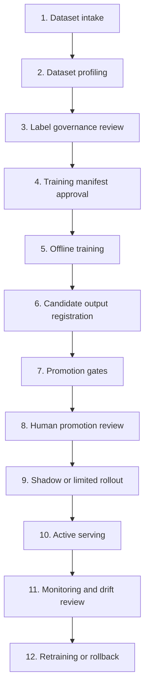

# ML Pipeline Runbook

This runbook defines the production ML workflow for `nwfwa`. It describes the
process, evidence, commands, owners, and gates. It does not require a final
production-quality model to exist before the workflow can be exercised.

## Operating Principle

The ML pipeline is an evidence factory, not an automatic adjudication system.

The process may automate dataset checks, feature materialization, training,
evaluation, artifact creation, and registration. Human review remains required
for label governance and model promotion because model output can influence FWA
routing and investigation workload.

## Workflow Summary



## Stage 1: Dataset Intake

Purpose: make the source dataset immutable and traceable before it can feed
training.

Required inputs:

- Parquet dataset path or partition directory.
- `dataset_key` and `dataset_version`.
- `label_column`.
- `entity_keys`, at minimum claim, member, policy, and provider identifiers.
- `service_date` or another approved time split field.
- `case_family_id` when related claims or investigations can leak across splits.
- business owner and source system.

Required evidence:

- immutable dataset URI;
- schema hash;
- row count by split;
- label distribution by split;
- source data quality score;
- dataset usage scope, such as pilot/customer, demo, or public research.

The API server stores dataset metadata and lineage. Large rows remain in Parquet
storage.

## Stage 2: Dataset Profiling

Purpose: verify the dataset is structurally usable before training.

Command:

```bash
cargo run --locked -p worker -- profile-parquet \
  --manifest data/training/manifest.json \
  --output-dir data/training/profile
```

Checks:

- manifest has at least one split;
- all split paths are Parquet files or Parquet directories;
- schemas match across splits;
- label column exists;
- entity keys exist;
- entity keys are string columns;
- missing rates and label distributions are captured.

Output artifacts:

- `schema.json`;
- `profile.json`;
- `catalog.json`.

## Stage 3: Label Governance Review

Purpose: decide whether labels may be used for training.

Reviewer responsibilities:

- confirm label definition, for example `confirmed_fwa`;
- reject labels produced only by the candidate model itself;
- separate final adjudication labels from investigation-support labels;
- mark labels as `approved_for_training` only after QA, investigation, medical,
  or business review;
- keep unresolved or disputed labels out of training promotion evidence.

Required evidence:

- reviewer source;
- approval status;
- notes without PII;
- evidence refs for the label source;
- count of approved labels and labels still needing review.

## Stage 4: Training Manifest Approval

Purpose: approve the exact training contract before execution.

Minimum manifest shape:

```json
{
  "dataset_key": "claims_model",
  "dataset_version": "2026-06-02",
  "label_column": "confirmed_fwa",
  "entity_keys": ["claim_id", "member_id", "policy_id", "provider_id"],
  "time_split_field": "service_date",
  "group_split_fields": ["member_id", "policy_id", "provider_id", "case_family_id"],
  "splits": [
    {"split_name": "train", "data_uri": "split=train/"},
    {"split_name": "validation", "data_uri": "split=validation/"},
    {"split_name": "out_of_time", "data_uri": "split=out_of_time/"}
  ]
}
```

Approval checks:

- time split exists and is not a post-outcome field;
- group split fields cover member, policy, provider, and case family when
  available;
- post-investigation fields are labels or excluded features;
- public research data is not treated as customer/pilot validation evidence;
- training data usage is compatible with the customer or pilot contract.

## Public Data MVP Path

When customer training data is not available, use the public-data MVP pack to
exercise the data and ML engineering loop without claiming production model
effectiveness.

Rust-generated Auto MLOps demo pack:

```bash
cargo run --locked -p worker -- build-demo-ml-datasets \
  --output-dir data/rust-automl-demo \
  --dataset-version 2026-06-rust-automl-demo
```

This writes:

- `labeled_claim_risk/manifest.json`: one labeled claim-risk dataset with
  train, validation, and out-of-time Parquet splits and `confirmed_fwa` as a
  weak demo label;
- `unlabeled_shadow_scoring/manifest.json`: unlabeled claim rows for shadow
  scoring, score-distribution, and drift exercises;
- `unlabeled_provider_peer_clustering/manifest.json`: unlabeled provider-month
  peer features for clustering and anomaly-discovery exercises.

Only the labeled manifest should be passed to supervised training or
`profile-parquet`. The unlabeled manifests are for scoring, clustering, and
manual-review candidate discovery; they are not training labels or production
promotion evidence.

```bash
uv run --project apps/ml-service \
  python scripts/data/build_public_data_mvp.py \
  --synthetic-fixture \
  --output-dir data/public-mvp \
  --dataset-version 2026-06-public-mvp
```

The generated `data/public-mvp/manifest.json` uses CMS/OIG-style public-data
features and weak labels only for pipeline execution. It can then be used with
the same profiling, training, Rust artifact export, handoff, and scheduled
monitoring commands as customer manifests.

For downloaded public extracts, provide local source files instead:

```bash
uv run --project apps/ml-service \
  python scripts/data/build_public_data_mvp.py \
  --synpuf-claims-csv /path/to/synpuf_claims.csv \
  --provider-summary-csv /path/to/cms_provider_summary.csv \
  --leie-csv /path/to/leie.csv \
  --policy-corpus-dir /path/to/policy_texts \
  --output-dir data/public-mvp \
  --dataset-version 2026-06-public-mvp
```

This path closes schema and pipeline gaps only. Customer label provenance,
customer holdout validation, and real shadow traffic remain required before
production model claims.

If the Kaggle Healthcare Provider Fraud archive has been downloaded locally,
build the provider-fraud demo pack:

```bash
uv run --project apps/ml-service \
  python scripts/data/build_kaggle_provider_fraud_mvp.py \
  --archive /Users/proerror/Downloads/archive.zip \
  --output-dir data/kaggle-provider-fraud \
  --dataset-version 2026-06-kaggle-provider-fraud-demo \
  --max-claims 5000 \
  --max-tpa-payloads 100
```

The generated manifest follows the same train/validation/out-of-time contract
and also writes `tpa_claims.jsonl` for inbox/scoring demos. Its label policy is
`weak_provider_level_label_not_claim_level_production_evidence`, because Kaggle
`PotentialFraud` is provider-level and cannot prove claim-level fraud.

## Stage 5: Offline Training

Purpose: create a candidate model artifact and validation evidence.

Command:

```bash
cd apps/ml-service
python -m app.train \
  --manifest ../../data/training/manifest.json \
  --artifact-base-uri ../../data/model-artifacts \
  --model-key baseline_fwa \
  --base-model-version 0.1.0 \
  --job-id model_retraining_job_1 \
  --actor trainer-worker \
  --algorithm xgboost
```

Current implementation:

- logistic regression baseline by default, plus `--algorithm xgboost` and
  `--algorithm lightgbm` for gradient-boosted-tree supervised-learning
  candidates;
- numeric feature columns from the manifest dataset;
- `.joblib` model artifact;
- `validation.json`;
- `feature_importance.parquet`;
- `serving_manifest.json` with artifact checksum, signature, and version lock;
- `feature_store_manifest.json` with materialized feature columns, split row
  counts, entity keys, and null-count evidence;
- `shadow_report.json` comparing the candidate against the heuristic baseline;
- `drift_report.json` with feature PSI and aggregate score PSI;
- `fairness_report.json` with segment precision and recall slices;
- retraining output payload printed to stdout.

The first production supervised-learning comparison should include the logistic
baseline, an XGBoost candidate, and a LightGBM candidate. Logistic exports both
a Python `.joblib` artifact and a Rust JSON serving artifact for the API
server's lightweight runtime. XGBoost and LightGBM export Python `.joblib`
training artifacts and serving manifests for the existing Python scorer
boundary today. The target path is ONNX export and Rust ONNX serving when
conversion preserves feature order and prediction parity. Until that parity gate
exists, both GBDT candidates remain governed candidates with feature-importance
evidence and the same registration, promotion, shadow, drift, and human-review
gates.

## Stage 6: Worker-Driven Candidate Registration

Purpose: let the worker claim a retraining job, run the trainer, and register
the candidate output with the API.

Command:

```bash
cargo run --locked -p worker -- run-retraining-job \
  --api-url "$FWA_API_BASE_URL" \
  --api-key "$FWA_API_KEY" \
  --actor trainer-worker \
  --artifact-base-uri data/model-artifacts \
  --training-manifest data/training/manifest.json \
  --trainer-python python \
  --model-key baseline_fwa
```

Behavior:

- without `--training-manifest`, the worker keeps the deterministic demo mock
  output path;
- with `--training-manifest`, the worker calls `python -m app.train`;
- the worker posts the trainer output to
  `/api/v1/ops/model-retraining-jobs/{job_id}/output`;
- the API creates a candidate model version and evaluation record if the output
  contract passes validation.

## Stage 6.5: Auto MLOps Candidate Ranking

Purpose: compare candidate validation reports and open human-review work without
promoting a model automatically.

Command:

```bash
cargo run --locked -p worker -- rank-automl-candidates \
  --validation-report data/model-artifacts/baseline_fwa/<logistic-version>/validation.json \
  --validation-report data/model-artifacts/baseline_fwa/<xgboost-version>/validation.json \
  --validation-report data/model-artifacts/baseline_fwa/<lightgbm-version>/validation.json \
  --output-dir data/model-artifacts/baseline_fwa/automl-ranking
```

The worker writes:

- `automl_candidate_ranking.json`;
- `automl_review_tasks.json`.

Ranking uses out-of-time AUC, average precision, precision, and recall, but
promotion gates still dominate. Candidates stay blocked when label provenance,
time/group split, leakage, shadow comparison, serving version lock, artifact
integrity, feature materialization, fairness, AUC, or recall evidence is
missing or failed. The output may recommend a candidate for human review; it
must not activate a model or publish a rule.

## Stage 6.6: Explainable Rule Candidate Mining

Purpose: turn explainable model evidence into draft Rule Studio candidates
without writing to the active rule library.

Command:

```bash
cargo run --locked -p worker -- mine-rule-candidates \
  --validation-report data/model-artifacts/baseline_fwa/<candidate-version>/validation.json \
  --feature-importance data/model-artifacts/baseline_fwa/<candidate-version>/feature_importance.parquet \
  --output-dir data/model-artifacts/baseline_fwa/<candidate-version>/rule-candidates
```

The worker writes:

- `rule_candidate_mining_plan.json`;
- `rule_candidate_backtest_requests.json`;
- `rule_candidate_review_tasks.json`.

The output is intentionally blocked from rule-library writeback. Each candidate
rule template keeps `threshold_selected_by_backtest` instead of a publishable
threshold. Before a candidate can enter Rule Studio publication flow, it must
pass deterministic backtest, false-positive review, human promotion review,
customer policy or model-governance approval, and shadow or limited rollout
when impact is high.

## Stage 6.7: Rule Candidate Backtest

Purpose: turn draft rule candidates into auditable backtest evidence before a
human reviewer decides whether they can move toward Rule Studio publication.

Command:

```bash
cargo run --locked -p worker -- run-rule-candidate-backtest \
  --candidate-plan data/model-artifacts/baseline_fwa/<candidate-version>/rule-candidates/rule_candidate_mining_plan.json \
  --dataset-manifest data/rust-automl-demo/labeled_claim_risk/manifest.json \
  --output-dir data/model-artifacts/baseline_fwa/<candidate-version>/rule-candidates/backtest
```

The worker writes:

- `rule_candidate_backtest_report.json`;
- `rule_candidate_backtest_review_tasks.json`.

The backtest selects a deterministic threshold from the training split and
reports hit rate, precision, recall, F1, false positives, false negatives, and
manual-review capacity impact for each dataset split. The report still sets
`rule_library_writeback_status` to blocked until human review and policy or
model-governance approval are complete.

## External Training Platform Boundary

Training may run on a separate ML platform such as a customer notebook
environment, managed training service, Kubeflow, Databricks, or a private
batch platform. That platform should not own a separate dataset definition. It
must consume the same Parquet dataset manifest used by profiling, model
governance, and demo/local training.

Required boundary:

- the API and dataset catalog remain the source of truth for dataset key,
  dataset version, manifest URI, schema/profile URI, label column, entity keys,
  time split, group split, and split names;
- the external platform reads the same Parquet dataset manifest and split files
  from governed storage;
- the training platform must not read application tables directly or create a
  hidden feature definition outside the manifest contract;
- the trainer writes model artifacts, serving manifest, feature materialization
  manifest, validation/OOT metrics, shadow report, drift report, fairness
  report, and feature-importance artifacts to governed artifact storage;
- the platform posts or hands off the same retraining output payload accepted by
  `/api/v1/ops/model-retraining-jobs/{job_id}/output`;
- the API remains responsible for candidate registration, promotion gates,
  activation, rollback, and audit events;
- Rust serving remains independent of the training platform by loading the
  activated serving manifest through `FWA_MODEL_SERVING_MANIFEST_URI`.

This keeps training portable without forking the data source. The local Python
trainer is only the compatibility implementation of the same contract.

External handoff command:

```bash
cargo run --locked -p worker -- build-training-handoff \
  --manifest data/training/manifest.json \
  --artifact-base-uri s3://fwa-models \
  --model-key baseline_fwa \
  --base-model-version 0.1.0 \
  --job-id model_retraining_job_1 \
  --actor trainer-worker
```

The command prints a handoff JSON document with `handoff_kind =
external_training_platform`. It names the same Parquet manifest, expected Rust
serving artifact, Python training artifact, serving manifest, validation
report, feature-store manifest, shadow report, drift report, fairness report,
and retraining output submit path. This is the contract an external training
platform should execute and return to the API.

Scheduled MLOps monitoring plan command:

```bash
cargo run --locked -p worker -- build-mlops-monitoring-plan \
  --manifest-uri s3://fwa-datasets/demo_claims_fwa/2026-05-demo/manifest.json \
  --artifact-uri s3://fwa-models/baseline_fwa/0.2.0/rust_serving_artifact.json \
  --model-key baseline_fwa \
  --model-version 0.2.0 \
  --cron "0 2 * * *"
```

The output is a `scheduled_mlops_monitoring` plan with five jobs:
`shadow_traffic_evaluation`, `drift_monitoring`, and
`segment_fairness_review`, `reviewer_disagreement_review`, and
`label_delay_review`. It is intentionally a plan document, not a built-in
scheduler, so customer or platform schedulers can run it without giving the
application direct control over production ML infrastructure.

## Stage 7: Promotion Gates

Purpose: block candidate models until the required evidence exists.

Promotion-ready evidence must include:

- immutable dataset and feature-set versions;
- holdout metrics;
- out-of-time metrics;
- time/group split strategy;
- leakage check;
- review-capacity threshold;
- explanation artifact;
- shadow comparison;
- source data quality;
- feature reproducibility hash;
- label provenance;
- pilot/customer validation;
- stable drift status;
- no unresolved model QA feedback;
- approved training labels;
- human approval.

The candidate should remain blocked when any gate is missing.

## Stage 8: Human Promotion Review

Purpose: separate automated metric production from release approval.

Promotion review should answer:

- Is this candidate better than rule-only and previous-model baselines?
- Is false-positive burden acceptable for the review team?
- Are labels approved and representative?
- Is out-of-time performance acceptable?
- Are provider/member/policy/case-family leakage controls sufficient?
- Is this candidate approved for shadow, limited rollout, or active routing?

Human approval should be recorded through the model promotion review API. The
training pipeline must not approve itself by writing approval into metrics.

## Stage 9: Shadow Or Limited Rollout

Purpose: observe live behavior before the model affects high-impact routing.

Shadow evidence should compare:

- candidate score distribution;
- rule-only output;
- previous active model output;
- QA decisions;
- reviewer disagreement;
- review-capacity usage;
- false-positive examples;
- high-risk misses discovered later.

Shadow mode is required before active pre-payment routing impact.

## Stage 10: Active Serving

Purpose: serve a governed active model version.

Local artifact-backed serving:

```bash
FWA_MODEL_SERVING_MANIFEST_URI=data/model-artifacts/baseline_fwa/<version>/serving_manifest.json \
FWA_MODEL_SIGNATURE_KEY=<signing-key> \
FWA_MODEL_SHADOW_HEURISTIC=true \
cargo run --locked -p api-server
```

The serving manifest path is preferred because it carries the model identity,
runtime kind, ordered feature list, threshold, artifact checksum, optional
signature, version lock, and training-artifact reference in one governed
contract. `rust_logistic_regression` manifests are served through
`ServingManifestModelScorer`, which delegates to the Rust artifact scorer after
manifest validation.

Direct artifact-backed serving remains available for local JSON logistic
artifacts:

```bash
FWA_MODEL_ARTIFACT_URI=data/model-artifacts/baseline_fwa/<version>/rust_serving_artifact.json \
FWA_MODEL_VERSION_LOCK=<version> \
FWA_MODEL_ARTIFACT_SHA256=sha256:<artifact-digest> \
FWA_MODEL_ARTIFACT_SIGNATURE=hmac-sha256:<artifact-signature> \
FWA_MODEL_SIGNATURE_KEY=<signing-key> \
cargo run --locked -p api-server
```

The service rejects an artifact when `FWA_MODEL_VERSION_LOCK` does not match the
loaded model version or when `FWA_MODEL_ARTIFACT_SHA256` does not match the file
digest. If `FWA_MODEL_ARTIFACT_SIGNATURE` is configured, the service also
verifies it with `FWA_MODEL_SIGNATURE_KEY`. When
`FWA_MODEL_SHADOW_HEURISTIC=true`, the response metadata records the heuristic
baseline score, score delta, and shadow status without changing the primary
model score.

For Rust runtime scoring, `FWA_MODEL_SERVING_MANIFEST_URI` points to a
`serving_manifest.json` generated by training. `FWA_MODEL_ARTIFACT_URI` is the
older direct path to a local JSON logistic-regression artifact consumed by the
API server's `ArtifactModelScorer`. The Python ML service path above continues
to use the trained `.joblib` artifact. The Rust artifact uses this shape:

```json
{
  "model_key": "baseline_fwa",
  "model_version": "0.2.0-rust",
  "runtime_kind": "rust_logistic_regression",
  "execution_provider": "cpu",
  "threshold": 0.5,
  "feature_columns": ["claim_amount_to_limit_ratio", "provider_profile_score"],
  "intercept": -2.0,
  "coefficients": {
    "claim_amount_to_limit_ratio": 4.0,
    "provider_profile_score": 0.01
  }
}
```

For XGBoost and LightGBM, `.joblib` remains a training artifact or Python
fallback artifact. Rust local serving requires an ONNX-serving manifest with
`runtime_kind` such as `xgboost_onnx` or `lightgbm_onnx`. The current Rust
runtime validates the ONNX manifest, feature order, and checksum, then rejects
execution until the ONNX Runtime session and parity test gate are implemented.
This prevents a `.joblib` artifact from being accidentally treated as Rust
serving evidence.

The active serving selector is:

1. `FWA_MODEL_SERVING_MANIFEST_URI` set: API server uses Rust serving-manifest
   scoring.
2. `FWA_MODEL_ARTIFACT_URI` set: API server uses direct Rust artifact scoring.
3. `FWA_MODEL_SERVICE_URL=heuristic` or `heuristic://...`: API server uses the
   Rust heuristic fallback.
4. Otherwise: API server uses the Python HTTP compatibility scorer.

Production serving should additionally provide:

- model artifact URI;
- artifact checksum;
- dependency lock;
- serving image;
- endpoint URL or pinned runtime identity;
- rollback target;
- latency and error budgets.

The heuristic scorer remains a fallback or demo path. It should not be promoted
as a production trained model.

## Stage 11: Monitoring

Purpose: decide whether the active model remains usable.

Monitor:

- model service latency and error rate;
- input schema drift;
- feature distribution drift;
- score drift;
- segment drift by scheme family, provider type, product, and review mode;
- calibration drift when calibrated probabilities exist;
- reviewer disagreement;
- label delay;
- false-positive burden;
- recovery and audit outcomes.

Monitoring should trigger retraining readiness, not automatic promotion.

The worker can generate the portable scheduled monitoring contract that an
external orchestrator should execute:

```bash
cargo run --locked -p worker -- build-mlops-monitoring-plan \
  --manifest-uri data/training/manifest.json \
  --artifact-uri s3://fwa-models/baseline_fwa/0.2.0/rust_serving_artifact.json \
  --model-key baseline_fwa \
  --model-version 0.2.0 \
  --cron "0 2 * * *"
```

The generated plan contains shadow traffic evaluation, drift monitoring,
segment fairness review, reviewer disagreement review, and label delay review
jobs. It uses the same governed Parquet dataset manifest and derives the
expected report URIs from the active serving artifact location. A production
scheduler should execute the plan and publish the resulting reports back into
the model governance evidence set.

## Stage 12: Retraining Or Rollback

Retraining triggers:

- drift status is `watch` or `drift`;
- approved new model labels are available;
- model QA feedback is unresolved or recurring;
- pilot/customer evidence shows threshold or feature degradation.

Rollback triggers:

- candidate harms routing quality;
- false-positive burden exceeds capacity;
- serving identity or artifact checksum is invalid;
- shadow evidence contradicts evaluation metrics;
- production incident or customer approval withdrawal.

Rollback must restore a recorded previous active version and audit the replaced
version.

## Responsibility Matrix

| Step | Data/ML | API/Platform | QA/Business | Approval required |
| --- | --- | --- | --- | --- |
| Dataset intake | prepares manifest | registers metadata | validates source meaning | yes |
| Profiling | reviews schema/profile | runs worker profiler | reviews data quality | yes |
| Label governance | checks label usability | records labels/evidence | approves labels | yes |
| Training | runs trainer | records job/output | reviews candidate context | no |
| Evaluation | computes metrics | stores evaluation | reviews false positives | yes for promotion |
| Promotion gates | supplies evidence | enforces gates | reviews blockers | yes |
| Shadow rollout | analyzes results | routes shadow traffic | reviews disagreement | yes |
| Activation | supplies final artifact | activates governed version | approves impact | yes |
| Monitoring | analyzes drift | records status | reviews business impact | no unless action |
| Rollback | supports diagnosis | restores version | confirms impact | yes |

## Verification Commands

```bash
apps/ml-service/.venv/bin/python -m pytest \
  apps/ml-service/tests/test_score.py \
  apps/ml-service/tests/test_training_pipeline.py -q

cargo test --locked -p worker

bash scripts/ci/check_repo.sh
```

For full repository confidence, run the broader CI suite before merging or
deploying.
