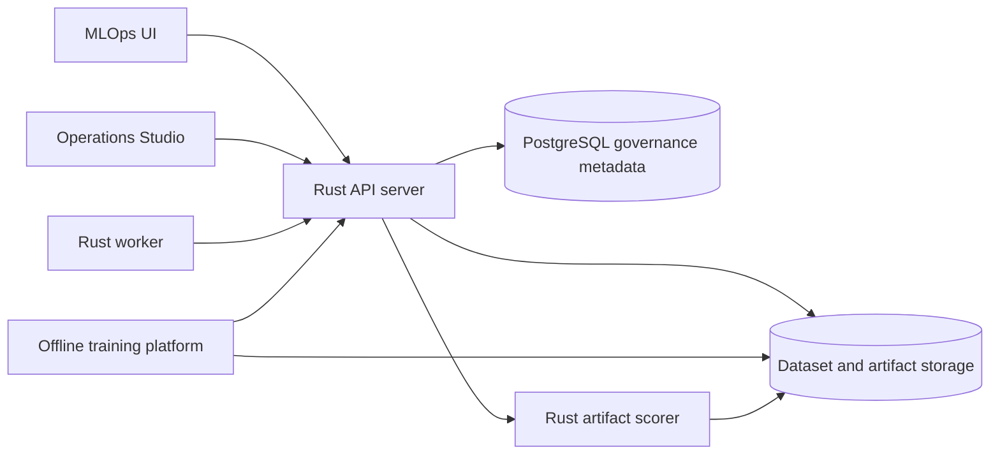

# MLOps UI Design

This document defines the separate MLOps user interface for `nwfwa`. It is a
governance and evidence console for model lifecycle work. It is not the claim
review workspace, and it must not turn model training into automatic claim
adjudication.

## Product Boundary

The existing Operations Studio is for claim and FWA operations:

- claim inbox normalization;
- runtime scoring;
- rule and routing operations;
- leads, cases, QA, medical review, knowledge, and audit workflows.

The MLOps UI is for data, model, and platform operators:

- dataset readiness;
- offline training jobs;
- candidate model evaluation;
- artifact governance;
- promotion review;
- activation and rollback;
- shadow, drift, fairness, and delayed-label monitoring.

Both UIs should use the same governed API server. The MLOps UI may be a separate
Yew/Trunk app later, but the first implementation can reuse the current
`/api/v1/ops/*` model and dataset APIs.

## Architecture



The architecture keeps responsibilities separated:

| Layer | Responsibility |
| --- | --- |
| MLOps UI | Human-facing model governance, evidence review, training job control, activation and rollback requests |
| API server | Authorization, validation, model registry, promotion gates, audit trail, activation and rollback state changes |
| Offline training platform | Reads approved Parquet manifest, trains model, writes artifacts and reports, submits retraining output |
| Rust serving runtime | Loads only approved and version-locked serving artifacts for online scoring |
| Object storage | Immutable dataset manifests, Parquet splits, model artifacts, reports, feature importance, manifests |
| Worker | Claims retraining jobs, runs or dispatches training, submits candidate output, emits monitoring plans |

Training must stay offline. Serving must load a governed artifact or pinned
model endpoint. The UI must not train and activate a model in one unreviewed
action.

## Users And Permissions

| Role | Allowed MLOps Actions |
| --- | --- |
| Data engineer | Register dataset metadata, inspect schema/profile, map fields, mark data-quality notes |
| ML engineer | Create retraining jobs, inspect training outputs, register candidate evidence |
| Risk model owner | Review evaluation, shadow, drift, and fairness reports; approve or reject promotion |
| Platform operator | Inspect serving health, artifact identity, activation state, rollback target |
| Auditor | Read-only access to datasets, jobs, evaluations, promotion decisions, activation and rollback audit events |

The default posture should be read-only unless the authenticated actor has an
explicit governance role. Activation and rollback require elevated permission
and must write audit events.

## Navigation

The first useful MLOps UI should have five primary pages:

1. Datasets
2. Training Jobs
3. Model Candidates
4. Promotion Gates
5. Monitoring

Serving and rollback can start as a section inside Model Candidates. They can be
split into a dedicated Deployment page after the runtime surface becomes denser.

## Page 1: Datasets

Purpose: show whether a dataset is usable for training, validation, or only
demo/research execution.

Primary table columns:

- dataset key;
- dataset version;
- source type: customer, pilot, public, Kaggle, synthetic;
- label policy;
- row count by split;
- label distribution by split;
- schema hash;
- time split field;
- group split fields;
- data quality score;
- production evidence status.

Detail view:

- immutable manifest URI;
- source system and owner;
- schema fields and canonical mappings;
- entity keys;
- missing-rate summary;
- label provenance summary;
- holdout and out-of-time split summary;
- leakage warnings;
- usage limitations.

Important boundary text:

```text
Public or Kaggle-inspired datasets may validate the pipeline contract, but they
cannot prove customer production model effectiveness.
```

Relevant APIs:

- `GET /api/v1/ops/datasets`;
- `POST /api/v1/ops/datasets`;
- `GET /api/v1/ops/datasets/{dataset_id}`;
- `POST /api/v1/ops/datasets/{dataset_id}/mappings`;
- `GET /api/v1/ops/factors/readiness`;
- `POST /api/v1/ops/feature-sets`;
- `POST /api/v1/ops/model-datasets`.

## Page 2: Training Jobs

Purpose: manage the offline training job lifecycle without implying automatic
promotion.

Primary table columns:

- job id;
- model key;
- dataset version;
- actor or platform;
- status: queued, claimed, running, validation, completed, failed;
- created time;
- updated time;
- artifact base URI;
- failure reason.

Detail view:

- training manifest URI;
- claimed by;
- command or external platform handoff;
- logs URI;
- output payload;
- candidate model version created from the output;
- validation and report artifact links.

Allowed actions:

- create retraining job;
- retry failed job when failure is operational;
- cancel queued job;
- copy external training handoff.

Disallowed actions:

- promote candidate automatically after training;
- edit training output after registration;
- mark public-data jobs as customer validation evidence.

Relevant APIs:

- `GET /api/v1/ops/models/{model_key}/retraining-jobs`;
- `POST /api/v1/ops/models/{model_key}/retraining-jobs`;
- `POST /api/v1/ops/model-retraining-jobs/{job_id}/status`;
- `POST /api/v1/ops/model-retraining-jobs/claim-next`;
- `POST /api/v1/ops/model-retraining-jobs/{job_id}/output`.

## Page 3: Model Candidates

Purpose: compare active and candidate versions with enough evidence to decide
whether the candidate can move to shadow, limited rollout, or active serving.

Primary table columns:

- model key;
- model version;
- status: candidate, approved, active, replaced, rejected;
- runtime kind;
- artifact URI;
- artifact integrity status;
- validation AUC or primary metric;
- out-of-time metric;
- shadow status;
- drift status;
- promotion readiness.

Detail view:

- serving manifest;
- artifact checksum and signature;
- feature-store manifest;
- validation report;
- feature importance artifact;
- shadow report;
- drift report;
- fairness report;
- confusion matrix;
- threshold;
- model explanations and feature attribution summary;
- active-vs-candidate comparison.

Relevant APIs:

- `GET /api/v1/ops/models`;
- `GET /api/v1/ops/models/{model_key}/performance`;
- `GET /api/v1/ops/model-evaluations`;
- `GET /api/v1/ops/model-evaluations/{evaluation_run_id}`;
- `POST /api/v1/ops/model-evaluations`.

## Page 4: Promotion Gates

Purpose: make promotion blockers explicit and require human review before
activation.

Gate groups:

- dataset quality;
- label provenance;
- time and group split integrity;
- leakage checks;
- customer or pilot validation evidence;
- validation and out-of-time quality;
- feature reproducibility;
- explanation artifact;
- shadow comparison;
- drift status;
- fairness and segment review;
- artifact checksum/signature;
- serving version lock;
- human promotion review.

Primary states:

- blocked;
- review required;
- approved for shadow;
- approved for limited rollout;
- approved for active serving;
- rejected.

Allowed actions:

- submit promotion review;
- approve for shadow;
- approve for limited rollout;
- approve for activation only when gates pass;
- reject with reason.

Relevant APIs:

- `GET /api/v1/ops/models/{model_key}/promotion-gates`;
- `POST /api/v1/ops/models/{model_key}/promotion-reviews`;
- `POST /api/v1/ops/models/{model_key}/activate`;
- `POST /api/v1/ops/models/{model_key}/rollback`.

Activation button rules:

- hidden or disabled unless promotion gates pass;
- show exact blockers when disabled;
- require actor, reason, and evidence refs;
- write an audit event through the API;
- never accept a public-data-only candidate as production promotion evidence.

## Page 5: Monitoring

Purpose: detect whether an active or shadow model is degrading and whether the
business impact justifies retraining or rollback.

Widgets:

- score distribution drift;
- feature PSI;
- input schema drift;
- segment drift by scheme family, provider type, product, and review mode;
- calibration drift when calibrated probabilities exist;
- shadow active-vs-candidate delta;
- reviewer disagreement;
- delayed label performance;
- false-positive cost;
- reviewer capacity impact;
- SLA and ROI impact.

Operational states:

- healthy;
- watch;
- drift;
- rollback review;
- retrain recommended.

Relevant commands and artifacts:

- `cargo run --locked -p worker -- build-mlops-monitoring-plan`;
- `cargo run --locked -p worker -- run-scheduled-mlops-monitoring`;
- `cargo run --locked -p worker -- run-mlops-monitoring-plan`;
- `shadow_report.json`;
- `drift_report.json`;
- `fairness_report.json`;
- reviewer-disagreement report;
- label-delay report.
- `mlops_monitoring_artifact_publication_manifest.json`.
- `scripts/ops/sample_mlops_monitoring_inputs.json` as the local binding
  example for customer or pilot monitoring metrics.

Monitoring should trigger retraining readiness or rollback review. It should not
promote or replace a model automatically.

## Offline Training Handoff

The MLOps UI should display the exact external training contract:

1. API registers or selects a governed dataset manifest.
2. Data or ML owner creates a retraining job.
3. Worker or external platform claims or receives the job.
4. Training platform reads the same Parquet manifest and writes artifacts.
5. Training platform submits the standard retraining output payload.
6. API validates output and registers a candidate model and evaluation.
7. MLOps UI shows evidence and promotion gates.
8. Human reviewer approves, rejects, or sends the model to shadow.
9. Platform operator activates or rolls back only through governed API actions.

The handoff must include:

- dataset manifest URI;
- model key;
- base model version;
- job id;
- expected artifact base URI;
- expected Rust serving artifact URI;
- expected validation, feature, shadow, drift, and fairness report URIs;
- output submit endpoint.

## Serving And Rollback

Serving identity shown by the UI:

- active model key;
- active model version;
- artifact URI;
- checksum;
- signature;
- version lock;
- runtime kind;
- fallback status;
- latest health check;
- previous approved active version.

Rollback should restore a previously approved active version. The UI should
separate:

- `previous_active_version`: the historical version being restored;
- `replaced_active_version`: the current version being demoted.

## MVP Implementation Order

Phase 1 should use existing APIs and focus on visibility:

1. Datasets list and detail.
2. Training jobs list and detail.
3. Model candidates list with evaluation links.
4. Promotion gates detail with blockers.
5. Monitoring artifact summary.

Phase 2 should add controlled actions:

1. create retraining job;
2. submit promotion review;
3. activate approved candidate;
4. rollback active model;
5. generate or view external training handoff.

Phase 3 should add production operations:

1. long-running scheduled drift dashboard;
2. shadow traffic comparison against real traffic;
3. customer holdout validation view;
4. segment/fairness review workflow;
5. artifact retention, legal hold, and signing-key health.

## Production Boundaries

The UI may show demo/public/Kaggle runs, but production labels and promotion
must require customer or pilot evidence. The UI must keep these boundaries
visible:

- provider-level public labels are not claim-level fraud truth;
- public-data and Kaggle runs are not customer production validation;
- model output is assistive evidence, not adjudication;
- promotion requires human review;
- monitoring triggers review, retraining, or rollback, not automatic promotion;
- production serving requires environment-specific secrets, object storage,
  observability, retention, signing keys, and customer network controls.
